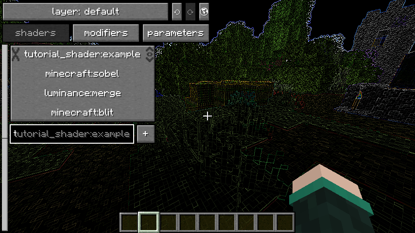
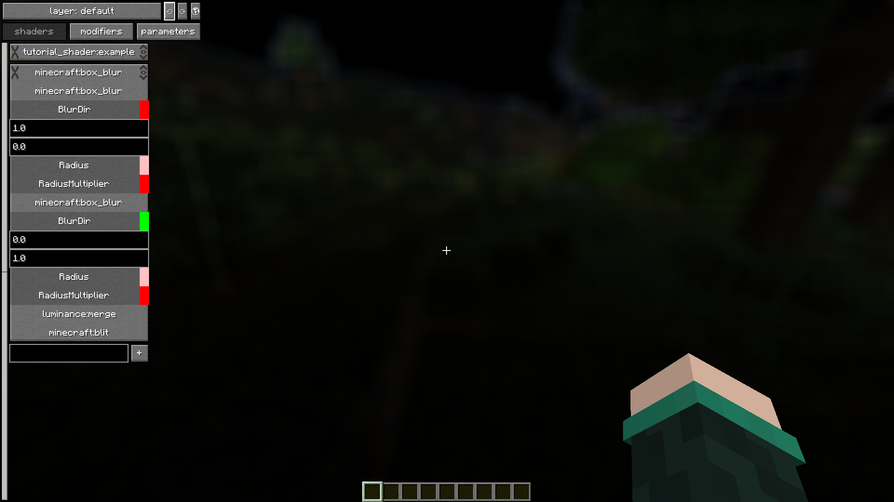
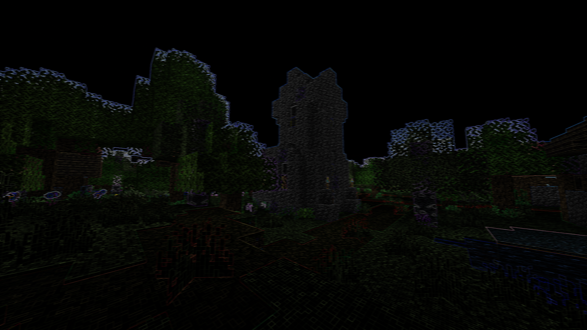
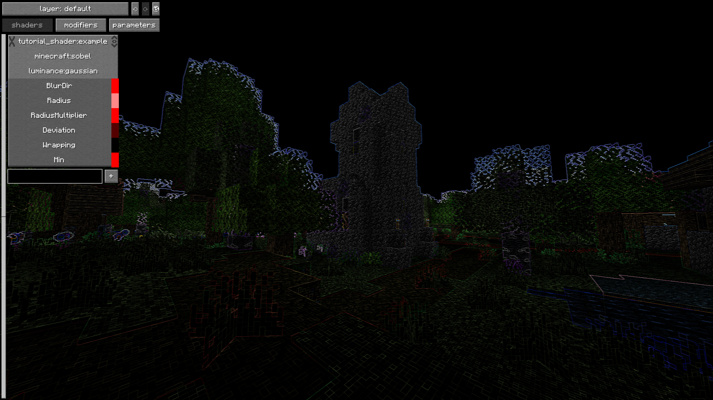
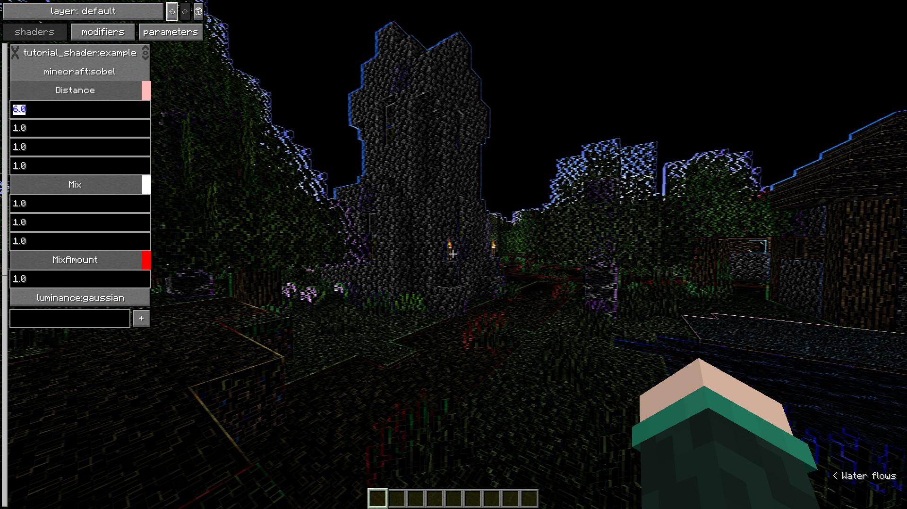
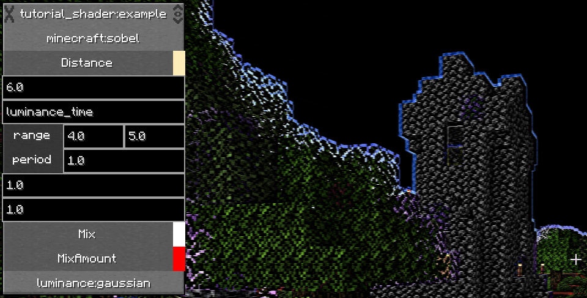
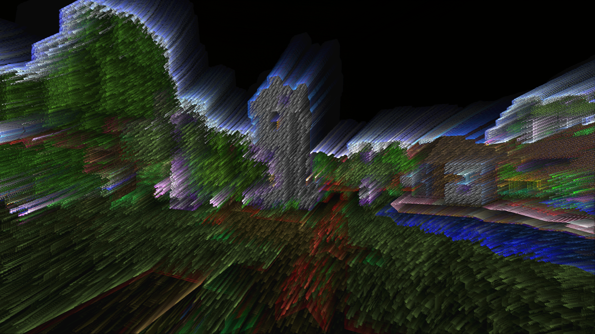
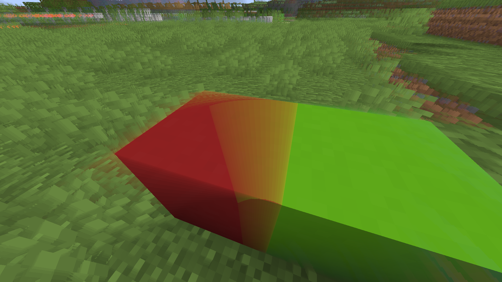
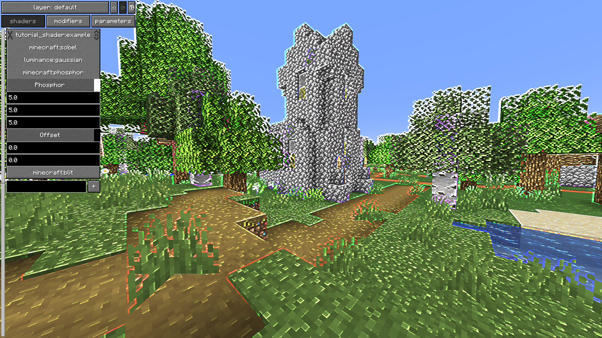

# Adding a Shader

To add a shader, we just add a new file for it in `luminance/`

```
TutorialShader
├── assets
│   └── tutorial_shader
│       ├── luminance
│       │   └── *example.json* [1]
│       ├── post_effect
│       │   └── *example.json* [2]
│       └── shaders
│           └── ...
├── pack.mcmeta
└── pack.png
```

```json
assets/tutorial_shader/luminance/example.json [1]
{
  "post_effect": "tutorial_shader:example"
}
```

Now that Luminance knows about the shader, the shader needs its render passes setup, so add a file in `<namespace>/post_effect` called `<name>.json` (in this case the value `"post_effect"` field is `"tutorial_shader:example"`, so the file is `tutorial_shader/post_effect/example.json`)

It's very useful to be able to reference existing shaders, some of these can be found in the [Minecraft Jar](https://mcasset.cloud/1.21.4/assets/minecraft/post_effect), however a lot have now been removed from the game, and are instead implemented [in Luminance itself](https://github.com/mclegoman/luminance/tree/development-1.21/common/src/main/resources/resourcepacks) (likewise all of [Soup's Shaders](https://github.com/Nettakrim/Souper-Secret-Settings/tree/luminance/src/main/resources/resourcepacks/soup) can be found in its resourcepacks)

*This section will explain how to add a modified vanilla shader program, to see how to write custom shaders, skip to the section on [writing shader code](WritingShaderCode.md), which will assume you have understanding of how the post shader files covered in this section work.*

# Post Shaders

for a fun base to work off of, im going to copy `assets/minecraft/shaders/post/sobel.json` [from Luminance](https://github.com/mclegoman/luminance/blob/development-1.21/common/src/main/resources/resourcepacks/super_secret_settings/assets/minecraft/post_effect/sobel.json) as it looks cool, this means I have this file:

```json
assets/tutorial_shader/shaders/post/example.json
{
  "targets": {
    "merge": {},
    "swap": {}
  },
  "passes": [
    {
      "program": "minecraft:post/sobel",
      "inputs": [
        {
          "sampler_name": "In",
          "target": "minecraft:main"
        }
      ],
      "output": "merge"
    },
    {
      "program": "luminance:post/merge",
      "inputs": [
        {
          "sampler_name": "In",
          "target": "merge"
        },
        {
          "sampler_name": "Merge",
          "target": "minecraft:main"
        }
      ],
      "output": "swap"
    },
    {
      "program": "minecraft:post/blit",
      "inputs": [
        {
          "sampler_name": "In",
          "target": "swap"
        }
      ],
      "output": "minecraft:main"
    }
  ]
}
```

Now, if i activate the shader, it will do the fun outline effect!


There are 2 parts to the post shader, a list of targets, and a list of passes

## Targets

Each pass tells the GPU to render an effect with some specific parameters, however each pass needs something to render to or from, so in the "targets" list we put the names of all our frame buffers - which can be thought of as images we can write to and read from.

Generally minecraft's shaders follow the standard where if there's only one target its called "swap", otherwise they are named "0", "1", "2" etc., or rarely named based on their purpose, but their names can be anything! - luminance also often uses a pass called "merge".

```json
"targets": {
  "merge": {},
  "swap": {}
}
```

the {} after the name is where settings can be put, which isnt used here, but could look something like:
```json
"targets": {
    "0": {
      "width": 16,
      "height": 16
    },
    "1": {
      "peristent": true
    }
}

```

`"width"` and `"height"` just determine the size of the target in pixels, by default the width and height will be the same as the screen's resolution

`"persistent"` is unique to Luminance and forces the target to be kept across frames, which will otherwise only happen under [specific circumstances](https://discord.com/channels/237199950235041794/823191668064911410/1325873027266646038) (link to shaderLABS discord)

## Passes

Each pass in the list is applied one after the other as a sequence of steps

A pass has 3 parts:

- the name of the shader program
- input frame buffers
- the output frame buffer

```json
{
  "program": "minecraft:post/sobel",
  "inputs": [
    {
      "sampler_name": "In",
      "target": "minecraft:main"
    }
  ],
  "output": "merge"
}
```


The `"program"` tells the render pass to use the program in `<namespace>/shaders/program/<name>.json`

The `"output"` is what target it writes to

The `"inputs`" are a list of targets that the program is using

At their simplest, an input has two parts, a `"sampler_name"` and a `"target"`

```json
{
  "sampler_name": "In",
  "target": "minecraft:main"
}
```

The `"sampler_name"` is what input of the corresponding `"program"` the input is going to, most shaders have their will main input as `"In"`

The `"target"` is what render target that input will be using, this can be anything from the list of targets, however here its actually `"minecraft:main"`, which is the id for the screen itself, so a post shader should generally end with the output being minecraft:main - otherwise you won't see anything change!

Following all the inputs and outputs, the post shader looks like

```json
minecraft:main  v                     v                    minecraft:post/blit
merge           minecraft:post/sobel  v
swap                                  luminance:post/merge ^

the notation here shows each target on the left, marking each row
programs are located on the row they output to
v and ^ show what targets each program uses, pointing to the relevant program from the targets row
```

The `minecraft:post/sobel` shader is whats doing the cool outline effect

`luminance:post/merge` has two inputs, the usual `In`, as well as one called `Merge` - this is how Luminance implements its Shader Strength feature, which mixes between the base image and the modified one

```json
{
  "program": "luminance:post/merge",
  "inputs": [
    {
      "sampler_name": "In",
      "target": "merge"
    },
    {
      "sampler_name": "Merge",
      "target": "minecraft:main"
    }
  ],
  "output": "swap"
}
```

And then the `minecraft:post/blit` at the end copies one target to another, since we need to get the image back to `minecraft:main`

The reason we do this instead of using the output of the `luminace:post/merge` to put it back onto `minecraft:main` directly is because the input targets cannot be the same as any of the output targets (since the buffers cant be read from and written to at the same time, if they are the input will just be black)

- A lot of soup: shaders implement Shader Strength as part of the effect itself, so there isnt a `luminanace:post/merge` pass


### Extra input stuff
Inputs have some extra optional fields

```json
{
  "sampler_name": "InA",
  "target": "minecraft:main",
  "use_depth_buffer": false,
  "bilinear": false
},
{
  "sampler_name": "InB",
  "location": "<namespace:id>",
  "width": 256,
  "height": 256,
  "bilinear": false
}
```

`"bilinear"` makes the sampler have bilinear filtering, which blurs the texture

`"use_depth_buffer"` makes the target use its associated depth instead of color, it works on the main target and the ones used for fabulous graphics (minecraft:translucent, minecraft:item_entity, minecraft:particles, minecraft:clouds, minecraft:weather) (note that the depth buffer only has information of the red channel of the sampler)

`"location"` is used to sample from textures instead of targets, resolving to `assets/<namespace>/textures/effect/<id>.png`, when using a location, `"width"` and `"height"` need to be the width and height of the image

# The fun bit!
Ok now that you hopefully know how the render passes work, it's time to combine them in some fun ways!

So i have my sobel shader from before, and saw that stacking "box_blur" on top of it with soup gives everything a weird ghostly look, so lets make that into a single shader

Looking at `minecraft/shaders/post/blur.json` to try figure out how to combine them, I can see that its way more complicated looking, whats that about?

```json
minecraft/post_effect/blur.json
{
  "targets": {
    "0": {},
    "1": {},
    "2": {}
  },
  "passes": [
    {
      "program": "minecraft:post/box_blur",
      "inputs": [
        {
          "sampler_name": "In",
          "target": "minecraft:main",
          "bilinear": true
        }
      ],
      "output": "0",
      "uniforms": [
        {
          "name": "BlurDir",
          "values": [ 1.0, 0.0 ]
        },
        {
          "name": "Radius",
          "values": [ 20.0 ]
        }
      ]
    },
    {
      "program": "minecraft:post/box_blur",
      "inputs": [
        {
          "sampler_name": "In",
          "target": "0",
          "bilinear": true
        }
      ],
      "output": "1",
      "uniforms": [
        {
          "name": "BlurDir",
          "values": [ 0.0, 1.0 ]
        },
        {
          "name": "Radius",
          "values": [ 20.0 ]
        }
      ]
    },
    {
      "program": "luminance:post/merge",
      "inputs": [
        {
          "sampler_name": "In",
          "target": "1"
        },
        {
          "sampler_name": "Merge",
          "target": "minecraft:main"
        }
      ],
      "output": "2"
    },
    {
      "program": "minecraft:post/blit",
      "inputs": [
        {
          "sampler_name": "In",
          "target": "2"
        }
      ],
      "output": "minecraft:main"
    }
  ]
}
```

## Uniforms

Uniforms are another part of each render pass, and they allow for the settings of a shader program to be different for each pass, instead of being hard coded

```json
"uniforms": [
    {
        "name": "BlurDir",
        "values": [ 1.0, 0.0 ]
    },
    {
        "name": "Radius",
        "values": [ 20.0 ]
    }
]
```

Each element in the list of uniforms has 2 parts, a name, and a value

To see what uniforms a program has, we could look for the program file, located at `assets/<namespace>/shaders/post/<id>.json` for a given `<namespace>:post/<id>` (note that it doesnt need a post/ to work, its just convention to put all shaders under post/)

```json
minecraft/shaders/post/blur.json
{
    ...
    "uniforms": [
      { "name": "ProjMat",          "type": "matrix4x4", "count": 16, "values": [ 1.0, 0.0, 0.0, 0.0, 0.0, 1.0, 0.0, 0.0, 0.0, 0.0, 1.0, 0.0, 0.0, 0.0, 0.0, 1.0 ] },
      { "name": "InSize",           "type": "float",     "count": 2,  "values": [ 1.0, 1.0 ] },
      { "name": "OutSize",          "type": "float",     "count": 2,  "values": [ 1.0, 1.0 ] },
      { "name": "BlurDir",          "type": "float",     "count": 2,  "values": [ 1.0, 1.0 ] },
      { "name": "Radius",           "type": "float",     "count": 1,  "values": [ 5.0 ] },
      { "name": "RadiusMultiplier", "type": "float",     "count": 1,  "values": [ 1.0 ] }
    ]
}
```

Which looks a little complicated, however the "ProjMat", "InSize", and "OutSize" uniforms are in pretty much every shader regardless, and we dont ever need (or really want) to touch them, so really all we need to look at is the last three, which can have their structure be made slightly more readable by spreading them out

```json
{
    "name": "BlurDir",
    "type": "float",
    "count": 2,
    "values": [ 1.0, 1.0 ]
},
{
    "name": "Radius",
    "type": "float",
    "count": 1,
    "values": [ 5.0 ]
},
{
    "name": "RadiusMultiplier",
    "type": "float",
    "count": 1,
    "values": [ 1.0 ]
}
```

This is how the program file defines what uniforms it has

The `"name"` is what we use to change them back in our render pass

the `"values"` are what its set to by default, which can give us an idea of what a reasonable input for the uniform is

the `"type"` is what type of number is in the `"values"` list - "float" means it's a floating point number, which is a number with a decimal point like 1.0, -0.5, 0.123 etc. You may also see "int", which is an integer, meaning its whole numbers only, like 0, 42, -1 etc

the `"count"` is how many of that number is in the `"values"` list
- a count of 2 often means the uniform represents a vector (position or offset in 2d space [usually either in pixels or as a fraction of the screen])
- a count of 3 often means the uniform represents a color represented as [r, g, b], where [1, 1, 1] is white and [0, 0, 0] is black

However, its much simpler to just view it in soup!



Which makes it much easier to see what uniforms everything has (note that soup visually removes the post/ from the names of the passes)

## Using Uniforms

So looking back at the blur render passes, it seems as though it first blurs the image on the x-axis with a radius of 20, then does the same on the y-axis

This should mean that if I change my example.json shader to

```json
assets/tutorial_shader/post_effect/example.json
{
  "targets": {
    "0": {}
  },
  "passes": [
    {
      "program": "minecraft:post/sobel",
      "inputs": [
        {
          "sampler_name": "In",
          "target": "minecraft:main"
        }
      ],
      "output": "0"
    },
    {
      "program": "minecraft:post/box_blur",
      "inputs": [
        {
          "sampler_name": "In",
          "target": "0"
        }
      ],
      "output": "minecraft:main",
      "uniforms": [
        {
          "name": "BlurDir",
          "values": [ 1.0, 0.0 ]
        },
        {
          "name": "Radius",
          "values": [ 3.0 ]
        }
      ]
    }
  ]
}
```

it will blur the sobel slightly horizontally, creating 6-7 pixel wide lines



There's an interesting checkerboard thing happening, i think because of an optimisation that box_blur does

Changing the box blur to luminance:post/gaussian, which has mostly the same structure, looks a little more as expected



I like how it looks when i change this value here to 6, so lets make that part of the shader by default!



Soup tells us the name of the variable, so we can just add it to the sobel passes uniforms like this

```json
...
"passes": [
        {
            "program": "minecraft:post/sobel",
            "inputs": [
                {
                    "sampler_name": "In",
                    "target": "minecraft:main"
                }
            ],
            "uniforms": [
                {
                    "name": "Distance",
                    "values": [ 6.0, 1.0, 1.0, 1.0 ]
                }
            ],
            "output": "0"
        },
        ...
]
...
```

### Dynamic Uniforms

Luminance allows for the values to be dynamic, accessible in soup like this:



Here the 2nd distance value has been set to go from 4 to 5 every 1 second, creating an interesting blinking effect

This can be done in the post effect json like this:

```json
{
  "name": "Distance",
  "values": [],
  "override": [ "6.0", "luminance_time", "1.0", "1.0" ],
  "config": [
    {"name": "1_soup_range", "values": [ 4.0, 5.0 ]},
    {"name": "1_period", "values": [ 1.0 ]}
  ]
}
```

The `"override"` field is what value the shader will use for each element of the uniform, these are all strings instead of numbers ("1.0" instead of 1.0)

When the values are being overridden, you do still need to have a `"values"` field, since theyre going to be overridden anyway, it can be anything, even just have an empty array `"values": []`!

The `"config"` field has a list of uniform config values, which determines how the uniforms are turning into the actual numbers. the names are prefixed with the index of the value being overriden, so 0_ for configuring the first override value, 1_ for the second etc
- `"luminance_time"` has a config value called `period` for how often it loops
- if you're using souper secret settings, all uniforms have a `soup_range` config (just called `range` in the ui)

If a shader's uniform name is already the name of a dynamic uniform (like it is in luminace:post/merge), it can be configured the same way with a prefix of 0_:
```json
{
  "name": "luminance_time",
  "values": [ 1.0 ],
  "config": [
    {
      "name": "0_period",
      "values": [ 6.0 ]
    }
  ]
}
```

# Tricking a Shader

Ok this is looking cool, and i noticed that if you stack phosphor you get some funky trails that are helped by the increased width from the blur and the offset



Wait, how does phosphor work? let's take a look: (dont worry, the heading will make sense after this quick diversion :P)

```json
minecraft/post_effect/phosphor.json
{
  "targets": {
    "merge": {},
    "swap": {},
    "previous": {"persistent": true}
  },
  "passes": [
    {
      "program": "minecraft:post/phosphor",
      "inputs": [
        {
          "sampler_name": "In",
          "target": "minecraft:main"
        },
        {
          "sampler_name": "Prev",
          "target": "previous"
        }
      ],
      "output": "merge",
      "uniforms": [
        {
          "name": "Phosphor",
          "values": [ 0.95, 0.95, 0.95 ]
        }
      ]
    },
    {
      "program": "minecraft:post/blit",
      "inputs": [
        {
          "sampler_name": "In",
          "target": "merge"
        }
      ],
      "output": "previous"
    },
    {
      "program": "luminance:post/merge",
      "inputs": [
        {
          "sampler_name": "In",
          "target": "merge"
        },
        {
          "sampler_name": "Merge",
          "target": "minecraft:main"
        }
      ],
      "output": "swap"
    },
    {
      "program": "minecraft:post/blit",
      "inputs": [
        {
          "sampler_name": "In",
          "target": "swap"
        }
      ],
      "output": "minecraft:main"
    }
  ]
}
```

This is a little long, so to break it down, lets follow the inputs and outputs again

```json
minecraft:main  v                                             v                    minecraft:post/blit
merge           minecraft:post/phosphor  v                    v
swap                                                          luminance:post/merge ^
previous        ^                        minecraft:post/blit

the notation here shows each target on the left, marking each row
programs are located on the row they output to
v and ^ show what targets each program uses, pointing to the relevant program from the targets row
```

The overall strucutre here isnt actually that much more complicated than last time
- Phoshpor combines main with the `previous` target, and that output is put onto `previous`.
- Then the original image and the phosphor output target have the usual luminance:post/merge -> blit

we can figure out that `previous` is intented to go across frames by the fact that its read from before writing to... and by the fact that at the top it has `"persistent": true`.

## Multiple Inputs

Time to look at the program file to learn more!

```json
minecraft/shaders/program/phosphor.json
{
  "vertex": "minecraft:post/sobel",
  "fragment": "minecraft:post/phosphor",
  "samplers": [
    { "name": "InSampler" },
    { "name": "PrevSampler" }
  ],
  "uniforms": [
    { "name": "ProjMat",  "type": "matrix4x4", "count": 16, "values": [ 1.0, 0.0, 0.0, 0.0, 0.0, 1.0, 0.0, 0.0, 0.0, 0.0, 1.0, 0.0, 0.0, 0.0, 0.0, 1.0 ] },
    { "name": "InSize",   "type": "float",     "count": 2,  "values": [ 1.0, 1.0 ] },
    { "name": "OutSize",  "type": "float",     "count": 2,  "values": [ 1.0, 1.0 ] },
    { "name": "Phosphor", "type": "float",     "count": 3,  "values": [ 0.3, 0.3, 0.3 ] },
    { "name": "Offset",   "type": "float",     "count": 2,  "values": [ 0.0, 0.0 ] }
  ]
}
```

We've already seen the `"uniforms"` bit of this earlier, but heres the whole program file

The `"vertex"` and `"fragment"` fields are what code the gpu is actually running, which resolves to the same `assets/<namespace>/shaders/post/<id>.<type>` for a given `<namespace>:post/<id>` as the program files, with the <type> for vertex being .vsh, and fragment .fsh

more information on this in [The Next Section](WritingShaderCode.md) (note that fragment shader is usually the important one, and that the vertex shader is *usually* `minecraft:post/sobel`, which doesnt actually have much to do with the sobel shader)

The actually important part here is the "samplers" section, which shows two samplers `"InSampler"` and `"PrevSampler"`, these are the names we saw earlier back in the post_effect

```json
"inputs": [
  {
    "sampler_name": "In",
    "target": "minecraft:main"
  },
  {
    "sampler_name": "Prev",
    "target": "previous"
  }
]
```

...almost, the names we use in the post_effect don't include Sampler, but otherwise they are the same, In is going to InSampler

Most shader programs will only have one or two inputs, but some (like transparency.json) have quite a few, there's not a strict limit

Let's take a quick peek at the fragment shader to see if we can figure out how PrevSampler is used

```glsl
minecraft/shaders/post/phosphor.fsh
--------------------------------------
#version 150

uniform sampler2D InSampler;
uniform sampler2D PrevSampler;

in vec2 texCoord;
in vec2 oneTexel;

uniform vec2 InSize;

uniform vec3 Phosphor;
uniform vec2 Offset;

out vec4 fragColor;

void main() {
  vec4 CurrTexel = texture(InSampler, texCoord);
  vec4 PrevTexel = texture(PrevSampler, texCoord + Offset*oneTexel);

  fragColor = vec4(max(PrevTexel.rgb * Phosphor, CurrTexel.rgb), 1.0);
}
```

Ok this doesn't look too complicated - looking just at the main() function at the bottom, we can see a few things
- CurrTexel involves the InSampler - so it probably means Current Texel
- PrevTexel involves the PrevSampler - so it probably means Previous Texel
- fragColor is set to something involving CurrTexel and PrevTexel

Lets try reverse engineer what this does:
- Just before the main function, we see `out vec4 fragColor;`, so fragColor is probably the color which is outputted
- PrevTexel and CurrTexel are both used with a .rgb - so they're definitely colours
- The color on the screen obviously varies from pixel to pixel, which means PrevTexel and CurrTexel need to be varying too, so texture(Sampler, texCoord) probably means "get the color at this Coordinate" - we see `in vec2 texCoord;` so it's presumably an input to the function in some way - "Texture Coordinate" seems like a reasonable expansion of texCoord
- We know that the uniform Phosphor is set to [0.95, 0.95, 0.95], and its being multiplied by the rgb value of the previous frame, this lines up with what we see in game - every frame the trail gets a little darker
- The max() function appears to wrap around the decayed previous color, and the current color, so the overall color of each pixel should be the highest between the current pixel and the previous pixel but a little smaller, this lines up with what we see in game - if we look at some red and green blocks and shake our head, the green channel from the green blocks leaks into the red but slowly decays as it's not being refreshed by CurrTexel and each frame it gets multiplied by 0.95, the red channel stays however, as every frame the red value from the red block is higher than the decayed red value of the previous frame



Interestingly, despite being used as motion blur, the overall function is really just `max(a*0.95, b)` for each rgb value in the two samplers - so theres nothing stopping us from using something other than the previous frame as our prev sampler, or using a different multiplier in the Phosphor uniform for only a specific channel

## The Trick

So that gives me an idea, what if I set the In on a phosphor pass to minecraft:main, and the Prev to the fun blurred sobel, if our theory on how the shader works is correct, the phosphor program should be able to combine the two with a per channel max() function, and it will also have a builtin per channel multiplier for our sobel target



Yeah! that looks cool, i had to increase the Phosphor values to [ 5.0, 5.0, 5.0 ] to get the sobelness to show up well, which as before was simple to make default to the shader.

```json
assets/tutorial_shader/shaders/post/example.json
{
  "targets": {
    "0": {},
    "1": {}
  },
  "passes": [
    {
      "program": "minecraft:post/sobel",
      "inputs": [
        {
          "sampler_name": "In",
          "target": "minecraft:main"
        }
      ],
      "uniforms": [
        {
          "name": "Distance",
          "values": [ 6.0, 4.0, 1.0, 1.0 ],
          "override": [ "6.0", "luminance_time", "1.0", "1.0" ],
          "config": [
            {"name": "1_soup_range", "values": [ 4.0, 5.0 ]},
            {"name": "1_period", "values": [ 1.0 ]}
          ]
        }
      ],
      "output": "0"
    },
    {
      "program": "luminance:post/gaussian",
      "inputs": [
        {
          "sampler_name": "In",
          "target": "0"
        }
      ],
      "output": "1",
      "uniforms": [
        {
          "name": "BlurDir",
          "values": [ 1.0, 0.0 ]
        },
        {
          "name": "Radius",
          "values": [ 3.0 ]
        }
      ]
    },
    {
      "program": "minecraft:post/phosphor",
      "inputs": [
        {
          "sampler_name": "In",
          "target": "minecraft:main"
        },
        {
          "sampler_name": "Prev",
          "target": "1"
        }
      ],
      "uniforms": [
        {
          "name": "Phosphor",
          "values": [ 5.0, 5.0, 5.0 ]
        }
      ],
      "output": "0"
    },
    {
      "program": "minecraft:post/blit",
      "inputs": [
        {
          "sampler_name": "In",
          "target": "0"
        }
      ],
      "output": "minecraft:main"
    }
  ]
}
```

Notice how this only uses 2 targets as I can reuse "0" - since its contents are no longer needed I can write over it and it doesn't matter

```json
minecraft:main  v                                               v                        minecraft:post/blit
0               minecraft:post/sobel  v                         minecraft:post/phoshpor  ^
1                                     luminance:post/gaussian   ^

the notation here shows each target on the left, marking each row
programs are located on the row they output to
v and ^ show what targets each program uses, pointing to the relevant program from the targets row
```

Now just to give it a better name than "example", im thinking "simulation" since the harsh colors, the way it picks up on outlines, and the slight blinking makes it look a bit like the world is a simulation that is breaking down, this is easy enough to do as I just need to change the `"post_effect"` field in the luminance/ json (and rename the file), and then rename the file in tutorial_shader/post_effect/ to match

We could also implement the luminance:post/merge thing that other shaders have relatively easily, but i wont do that here as its not important (it would just replace the final `... -> minecraft:post/blit` with `... -> luminance:post/merge -> minecraft:post/blit`)

We've already looked a little at the program files, but how do we make them? and what do they actually do? well, for that we need to learn how to [Write Shader Code](WritingShaderCode.md) - However a key takeaway here is that you can get a lot of mileage out of misusing existing shaders!

You can download the resourcepack made in this guide for reference [Here](https://github.com/mclegoman/luminance/ResourcepackGuide/TutorialShader.zip)

TODO: adding translation files