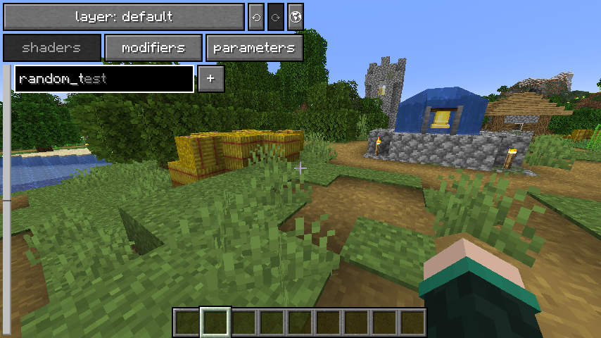

# Resourcepack Setup

For these examples, I will be using a folder layout that looks like this:

```
TutorialShader
├── assets
│   └── tutorial_shader
│       ├── luminance
│       │   └── ...
│       ├── post_effect
│       │   └── ...
│       └── shaders
│           └── ...
├── pack.mcmeta
└── pack.png
```

`tutorial_shader/` is the resourcepacks namespace as per usual, this can of course be whatever you want, this is the namespace all added shaders will be under.

The `luminance/` folder within it is where all the data luminance needs to know what shader is what goes.

The `post_effect/` folder is where the shaders are actually defined, this works the same as vanilla.

As does the `shaders/` folder, which is where the all code for the shaders is stored.

# luminance/<...>.json

The files in the `luminance/` folder look like this:

```json
{
  "post_effect": "<namespace:id>",
  "enabled": true,
  "disable_ui_rendertype": <...>,
  "registries": [ ... ],
  "custom": {
    "souper_secret_settings": {
      "groups": [ <...> ]
    }
  }
}
```

`"post_effect"` is what file in the `post_effect/` folder the shader is using, for instance `"minecraft:sobel"` would point to `minecraft/post_effect/sobel.json`.
- the name of the file itself can be anything (the value in `"post_effect"` is what the shader will be referred to as by luminance)
- but it should usually be named the id for consistency (so in this case `sobel`)
- if the field is missing, the filename and namespace of the file is used (so `assets/*minecraft*/luminance/*sobel*.json` will have a default `"post_effect"` of `minecaft:sobel`)

`"enabled"` is whether the shader is enabled, see [below](#changing-shaders) for details, by default it is `true`

`"disable_ui_rendertype"` is whether the shader should be allowed to be rendered after ui (false), or if it can only be rendered before (true). This is done when the shader uses depth (since depth doesnt work properly after ui), or when the shader disruptive enough to make ui unreadable.
- soup does not adhere to this, instead having a button that toggles rendering between game and world
- by default this is `false`

`"registries"` is what lists of shaders the shader will show up in
- `"luminance:main"`: default value if the field is missing, this is where soup and perspective look to get the list of shaders that can be used
- `"souper_secret_settings:modifiers"`: used by soup for its [modifier system](Soup.md#modifiers), the separate registry means they cant be used as regular shaders (which is good, as they wouldn't work)

`"custom"` is where any mod specific data is stored
- soup uses this to categorise shaders with the `"groups"` list, by default adding shaders to the `"edible"` category, meaning they can be chosen when eating soup, but since some soup shaders are particularly disruptive or laggy, not everything is `"edible"`, [see soup's page for more info](Soup.md#soup-groups)

## Changing Shaders

Although the `"post_effect"` field is where it gets the id from, you need to match the file location a shader uses in order for `"enabled": false` to reliably disable a shader

```json
assets/tutorial_shader/luminance/test.json - might work, at random
assets/minecraft/luminance/sobel.json - will work (as long as the resourcepack is higher priority)
{
  "post_effect": "minecraft:sobel",
  "enabled": false
}
```

Likewise the behaviour of adding a shader to a [Soup Group](Soup.md#soup-groups) depends on if the file path is matched:

```json
assets/tutorial_shader/luminance/test.json - adds to list
assets/minecraft/luminance/sobel.json - replaces the list, so sobel gets removed from "edible"
{
  "post_effect": "minecraft:sobel",
  "custom": {
    "souper_secret_settings": {
      "groups": [ "test" ]
    }
  }
}
```




## Adding Shaders

Now that your resourcepack is set up to work with luminance, you can [Add Shaders](AddingShaders.md).

You can download the resourcepack made in this guide for reference [Here](https://github.com/mclegoman/luminance/blob/development-1.21/ResourcepackGuide/TutorialShader.zip)