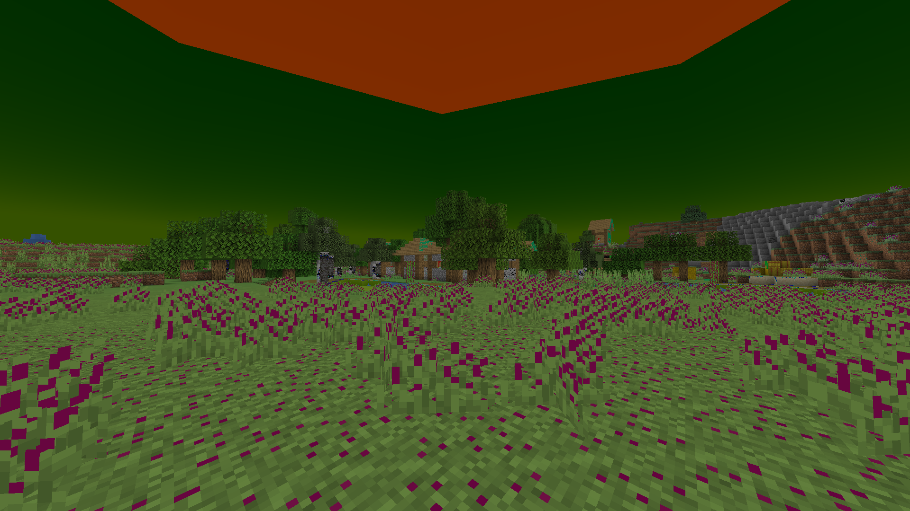
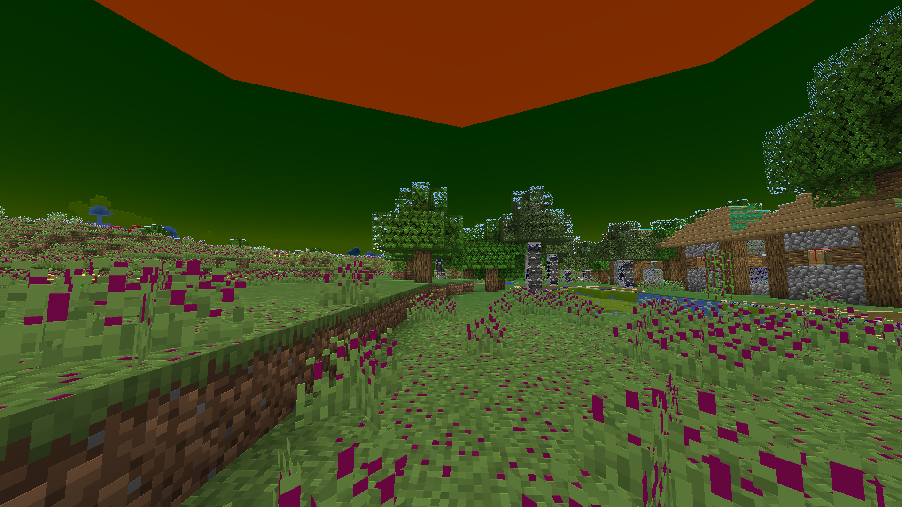
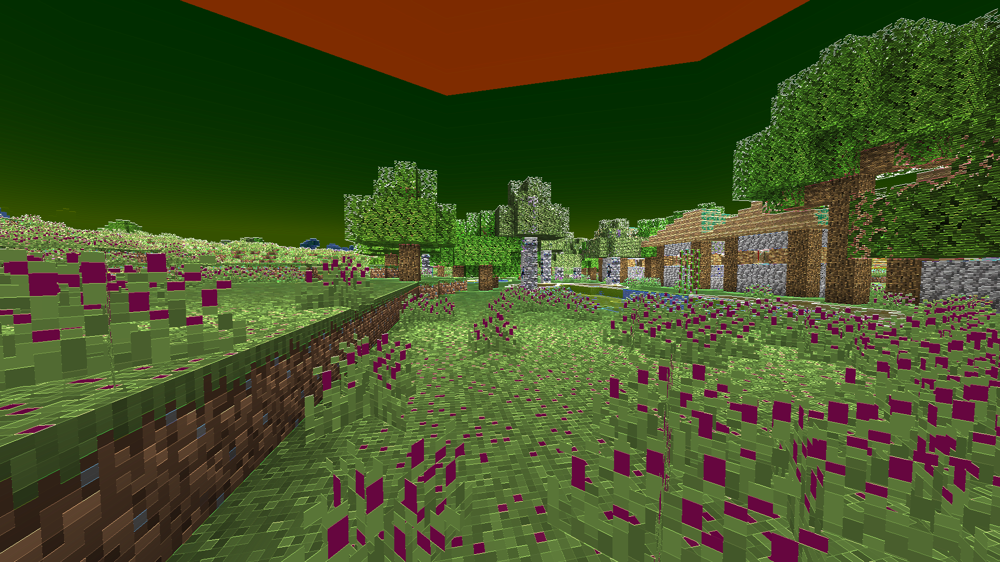
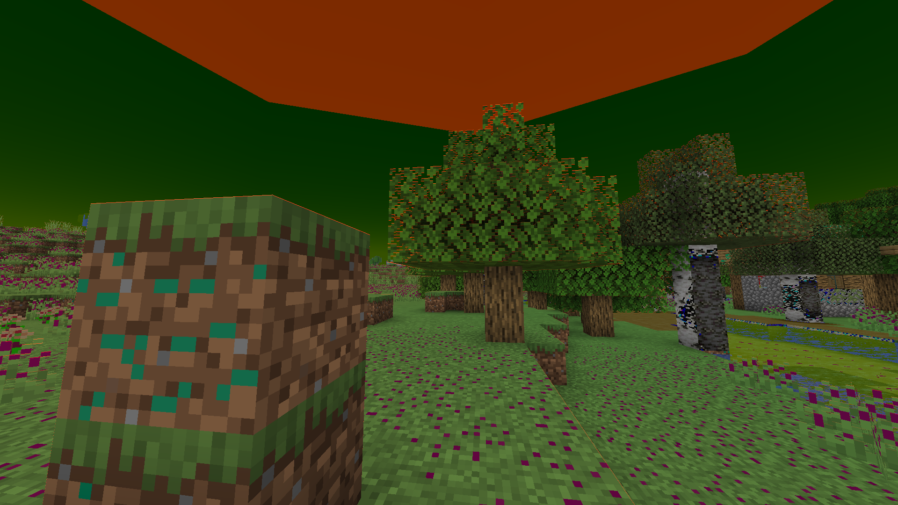
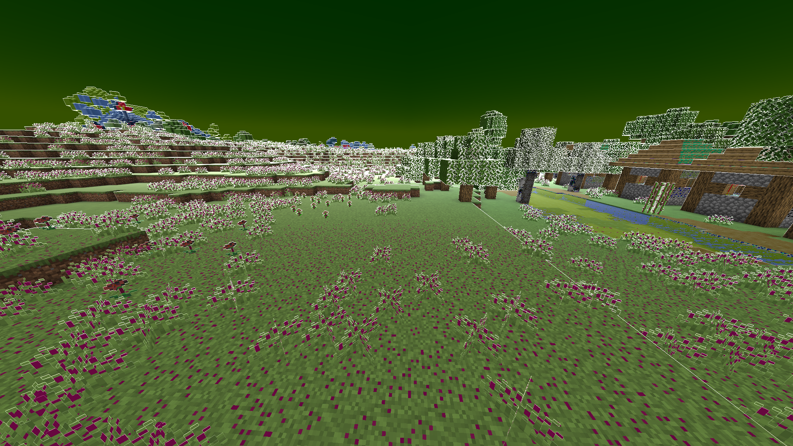
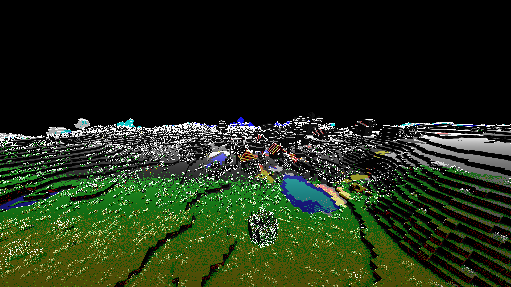

# Writing Shader Code

```
TutorialShader
├── assets
│   └── tutorial_shader
│       ├── luminance
│       │   └── simulation.json
│       │   └── *example_luminance.json* [1]
│       ├── post_effect
│       │   └── simulation.json
│       │   └── *example_post_effect.json* [2]
│       └── shaders
│           └── post
│               └── *example_program.json* [3]
├── pack.mcmeta
└── pack.png
```

First things first, lets add a new file to luminance/

```json
assets/tutorial_shader/luminance/example_luminance.json [1]
{
  "post_effect": "tutorial_shader:example_post_effect"
}
```

And we can get our post shader ready as well - Since we will be dealing with a lot more files im naming all my files `example_<type>` to make it clear what points where, but this is not necessary, minecraft, luminance, and my own soup would just keep everything named `example`

We have already learnt that the "program" field points to `<namespace>/shaders/program/<id>.json`, so we can make a shader that does a new program, then blits it back to main

```json
assets/tutorial_shader/post_effect/example_post.json [2]
{
  "targets": {
    "0": {}
  },
  "passes": [
    {
      "program": "tutorial_shader:post/example_program",
      "inputs": [
        {
          "sampler_name": "In",
          "target": "minecraft:main"
        }
      ],
      "output": "0"
    },
    {
      "program": "minecraft:post/blit",
      "inputs": [
        {
          "sampler_name": "In",
          "target": "0"
        }
      ],
      "output": "minecraft:main"
    }
  ]
}
```

Let's go ahead and copy one of minecraft's shader programs into our example program, I'll use box_blur since we are already somewhat familiar with it, and it will help explain how to use uniforms later on

```json
assets/tutorial_shader/shaders/post/example_program.json [3]
{
  "vertex": "minecraft:post/blur",
  "fragment": "minecraft:post/box_blur",
  "samplers": [
    {"name": "InSampler"}
  ],
  "uniforms": [
    {"name": "ProjMat",          "type": "matrix4x4", "count": 16, "values": [1, 0, 0, 0, 0, 1, 0, 0, 0, 0, 1, 0, 0, 0, 0, 1]},
    {"name": "InSize",           "type": "float", "count": 2, "values": [1, 1]},
    {"name": "OutSize",          "type": "float", "count": 2, "values": [1, 1]},
    {"name": "BlurDir",          "type": "float", "count": 2, "values": [1, 1]},
    {"name": "Radius",           "type": "float", "count": 1, "values": [5]},
    {"name": "RadiusMultiplier", "type": "float", "count": 1, "values": [1]}
  ]
}
```

Now that this is copied in, the shader does work, and it blurs the screen diagonally a small amount - which is to be expected, as the default BlurDir is [1.0, 1.0], and the radius is 5.0, but that's besides the point, lets see what each part of this json is doing

```json
"vertex": "minecraft:post/blur",
"fragment": "minecraft:post/box_blur",
```

As mentioned in the last section, the "vertex" field tells the program what vertex shader to use, so in this case it points to `minecraft/shaders/program/sobel.vsh` (.vsh meaning vertex shader)
The "fragment" field tells the program what fragment shader to use, in this case that's `minecraft/shaders/program/blur.fsh` (.fsh meaning fragment shader)

In this context, the vertex shader is applied to the 4 corners of the screen, and computes values that can get interpolated across the screen (notably screen coordinates)

The fragment shader is whats actually determining what each pixel on the screen will look like

Most of vanilla's shaders use the vertex shader "sobel", which is used by the sobel shader program, but isn't overly related to the sobel effect

```json
"samplers": [
  {"name": "InSampler"}
],
```

Again, we've already seen how samplers work, there's a list of samplers, accessible with their name minus Sampler

```json
"uniforms": [
  {"name": "ProjMat",          "type": "matrix4x4", "count": 16, "values": [1, 0, 0, 0, 0, 1, 0, 0, 0, 0, 1, 0, 0, 0, 0, 1]},
  {"name": "InSize",           "type": "float", "count": 2, "values": [1, 1]},
  {"name": "OutSize",          "type": "float", "count": 2, "values": [1, 1]},
  {"name": "BlurDir",          "type": "float", "count": 2, "values": [1, 1]},
  {"name": "Radius",           "type": "float", "count": 1, "values": [5]},
  {"name": "RadiusMultiplier", "type": "float", "count": 1, "values": [1]}
]
```

We've also already seen uniforms - there's a list of names, types, counts, and default values

The ProjMat is a 4x4 projection matrix, which is theoretically used to transform the screen coordinates, but it doesn't seem to do anything, InSize and OutSize are used in the vertex shaders - I think they are controlled automatically by the game to determine how big the frame buffers are, but I have not verified this (the In in InSize is related to InSampler, if you had another sampler, eg PrevSampler, then PrevSize would work)

BlurDir, Radius, and RadiusMultiplier are of course exclusive to the blur fragment shader

## Fragment Shaders

To use a fragment shader, we need to put it in the `"fragment"` field, and this can of course be namespaced

I've also changed the vertex shader to `minecraft:post/sobel`, since it gives some useful values, there's generally not much of a reason to use other vertex shaders.

```json
assets/tutorial_shader/shaders/post/example_program.json [3]
{
  "vertex": "minecraft:post/sobel",
  "fragment": "tutorial_shader:post/example_fragment",
  "samplers": [
    {"name": "InSampler"}
  ],
  "uniforms": [
    {"name": "ProjMat",          "type": "matrix4x4", "count": 16, "values": [1, 0, 0, 0, 0, 1, 0, 0, 0, 0, 1, 0, 0, 0, 0, 1]},
    {"name": "InSize",           "type": "float", "count": 2, "values": [1, 1]},
    {"name": "OutSize",          "type": "float", "count": 2, "values": [1, 1]},
    {"name": "BlurDir",          "type": "float", "count": 2, "values": [1, 1]},
    {"name": "Radius",           "type": "float", "count": 1, "values": [5]},
    {"name": "RadiusMultiplier", "type": "float", "count": 1, "values": [1]}
  ]
}
```

Then we set up our fragment shader file

```
TutorialShader
├── assets
│   └── tutorial_shader
│       ├── luminance
│       │   └── simulation.json
│       │   └── example_luminance.json [1]
│       ├── post_effect
│       │   └── simulation.json
│       │   └── example_post_effect.json [2]
│       └── shaders
│           └── post
│               ├── example_program.json [3]
│               └── *example_fragment.fsh* [4]
├── pack.mcmeta
└── pack.png
```


```glsl
assets/tutorial_shader/shaders/post/example_fragment.fsh [4]
--------------------------------------------------------
#version 150

uniform sampler2D InSampler;

in vec2 texCoord;
in vec2 oneTexel;

out vec4 fragColor;

void main() {
    vec4 color = texture(InSampler, texCoord);
    fragColor = vec4(color.rgb, 1.0);
}
```

The language this is written in is called GLSL, I will cover some basic topics here, but I will also expect some knowledge in general programming, for more examples and tutorials, albeit outside the context of minecraft, you can look at some of these:

Tutorials: https://www.shadertoy.com/view/Md23DV, https://thebookofshaders.com/

Shadertoy (a bunch of non minecraft examples, and in browser editing):
https://www.shadertoy.com/

GLSL Docs:
https://docs.gl/sl4/abs

<br>

First of all, I'll quickly explain the basic "do nothing" fragment shader above, it starts with a version number, this is the GLSL version, for our purposes this is always going to be 150

Next up we list our samplers, as discovered previously, these are how we access the frame buffers

After this is our inputs, `texCoord` allows us to get pixels from the samplers, which i'll explain shortly, `oneTexel` is provided by the sobel vertex shader we said we were using back in the program file, and it tells us how big each pixel is, more detail shortly

After that is a line saying we will be outputting a fragment color, this again, does not change

Then there is our main() function!

The main() function is run for each pixel on the screen, and the value we set fragColor to is the final color of that pixel

To get the color of the current pixel, we use `texture(InSampler, texCoord)`, texCoord is a vec2, where (0, 0) is the bottom left of the screen, and (1, 1) is the top right

oneTexel is calculated as (1/ScreenWidth, 1/ScreenHeight), so if we do `texture(InSampler, texCoord+oneTexel)`, then each pixel is the color of the pixel up and to the right of it, essentially moving the whole screen down and to the left

It's important that the final color is wrapped in a `vec4(col.rgb, 1.0)` (forcing the alpha to 1.0), or shaders sometimes won't stack properly

#

There are quite a few different variables types, the table below is not a complete list, but it is every single variable type you can use in a uniform, and it covers the important types

| type      | count | GLSL type |
|-----------|-------|-----------|
| float     | 1     | float     |
| float     | 2     | vec2      |
| float     | 3     | vec3      |
| float     | 4     | vec4      |
| int       | 1     | int       |
| int       | 2     | ivec2     |
| int       | 3     | ivec3     |
| int       | 4     | ivec4     |
| matrix2x2 | 4     | mat2      |
| matrix3x3 | 9     | mat3      |
| matrix4x4 | 16    | mat4      |

If you are familiar with C based languages, GLSL syntax won't be too complicated

It is recommended you use an IDE with support for GLSL (ive used both IDEA and VSCode with their relevant plugins), that way it can tell you if you're making a mistake, and it can help you find the function you want

Here's a range of "things you can do" so you can get a feel for how it works

```c#
//float maths
float a = 0.5;
float b = 6.0;
float c = a*b; // 3.0
float d = a+b; // 6.5
c-=2; // 1.0
...etc

//multiply vector by float
vec2 a = vec2(0.5, -2);
float b = 2;
vec2 c = a*b; // (1.0, -4.0)
vec2 d = a/b; // (0.25, -1.0)

//multpliy vectors together
vec3 a = vec3(0.0, 1.0, 0.5);
vec3 b = vec3(10, 2, 3);
vec3 c = a*b; // (0.0, 2.0, 1.5)

//get and set part of vector - the parts of a vec2 are (x, y), vec3 is (r, g, b), vec4 is (r, g, b, a)
vec2 a = vec2(1.0, 2.0);
a.x = -1.0; // (-1.0, 2.0)
a.y = a.x; // (-1.0, -1.0)

//swizzle vector - essentially combines getting parts of a vector and constructing a vector into one
vec4 a = vec4(1.0, 2.0, 3.0, 4.0);
vec4 b = a.brga // (3.0, 1.0, 2.0, 4.0)
vec2 c = vec2(2.0, 1.0)
vec3 d = c.xyx // (2.0, 1.0, 2.0)

//integers
int a = 2;
ivec2 b = ivec2(2, 3);
ivec2 c = b/a // (1, 1)

//for loop
int steps = 5;
float total = 0.0
for(float x = 0.0; x < steps; x += 1.0) {
    total += x;
}
// 0 + 1 + 2 + 3 + 4

//a handful of useful functions, most work for various combinations of vectors, floats, and ints - if your IDE has support for GLSL it will probably tell you what you can do
//The glsl documentation (https://docs.gl/sl4/abs) lists all the functions

abs(-1.0) // 1.0
abs(vec2(-1.0, 2.0)) // (1.0, 2.0)

fract(2.5) // 0.5
floor(2.5) // 2

mod(2.5, 2) // 0.5

mix(1.0, 2.0, 0.25) // 1.25
mix(0.0, 4.0, 0.5) // 2.0
mix(vec3(), vec3(), x) // == vec3(mix(a.r, b.r, x), mix(a.g, b.g, x), mix(a.b, b.b, x))

min(-1.0, 2.0) // -1.0
max(-1.0, 2.0) // 2.0

//functions
float f(float x, float y, float z) {
    return (x*x + y*y)/z
}
f(2.0, 3.0, 5.0) // 2.6

vec3 f(vec2 x) {
    //etc
}
```

With that in mind we can do pretty much anything!

Here each chanel gets moduloed by 0.5, meaning rgb values 0-0.5 stay the same, but 0.5-1 gets moved down to 0-0.5

This means darker colors remain the same, but once a color gets bright enough there's an interesting looking discontinuity

Note that colors are not 0-255, and are instead 0.0-1.0, this makes a lot of maths like multiplication nice to work with

```c#
void main() {
    vec4 col = texture(InSampler, texCoord);

    col = mod(col, 0.5);

    fragColor = vec4(col.rgb, 1.0);
}
```



We can use oneTexel to get adjacent pixels, here I add on the difference between the current pixel and the one above to see how it looks - if, for example, I wanted to look 2 pixels to the left, I could do `texCoord+vec2(oneTexel.x*2.0, 0.0)`

```c#
void main() {
    vec4 col = texture(InSampler, texCoord);

    vec4 up = texture(InSampler, texCoord+vec2(0.0, oneTexel.y));

    vec4 diff = abs(col-up);

    col = mod(col, 0.5)+diff;

    fragColor = vec4(col.rgb, 1.0);
}
```

This shader is adding the difference between the adjacent pixel to the image, so where the colors, change, it gets a little brighter - and this difference calculation is on the raw pixels, so this doesn't happen where the modulo is creating discontinuities.



This creates an interesting bumpy effect, however its quite subtle, so we can use a uniform to allow its brightness to be more dynamically adjusted

On the fragment shader side, this is done like this:

```c#
...
out vec4 fragColor;

uniform float BumpScale;

void main() {
    vec4 col = texture(InSampler, texCoord);

    vec4 up = texture(InSampler, texCoord+vec2(0.0, oneTexel.y));

    vec4 diff = abs(col-up);

    col = mod(col, 0.5)+(diff*BumpScale);

    fragColor = vec4(col.rgb, 1.0);
}
```

`uniform float BumpScale` has been added just above the function, the `uniform` keyword lets the computer know its a uniform, `float` is its type, and `BumpScale` is the variable name

The only difference in the code is changing `col = mod(col, 0.5)+diff;` to `col = mod(col, 0.5)+(diff*BumpScale);` - so just multiplying the difference by our BumpScale variable

And on the program json we just add it to the end of our list of uniforms - the type, float and count needed for each GLSL variable type can be seen in the earlier table

```json
assets/tutorial_shader/shaders/program/example_program.json [3]

"uniforms": [
    ...
    { "name": "BumpScale", "type": "float", "count": 1, "values": [ 1.0 ]}
]
```

Then we can mess around with it in souper secret settings until we find a value we like!

I quite like how it looks when its really strong, with a value of 5.0, so i could either replace the `"values": [ 1.0 ]` in the program file, or put it in the pass like this:

```json
assets/tutorial_shader/shaders/post/example_post.json [2]
"passes": [
    {
        "program": "tutorial_shader:post/example_program",
        "inputs": [
            {
                "sampler_name": "In",
                "target": "minecraft:main"
            }
        ],
        "uniforms": [
            {
                "name": "BumpScale",
                "values": [ 5.0 ]
            }
        ],
        "output": "0"
    },
    ...
]
```



Yeah! that's looking better!, now, what if instead of the difference being based on color, it's based on depth? let's set up another sampler!

## Setting up Another Sampler

first lets add our new sampler to the shader file
```c#
assets/tutorial_shader/shaders/post/example_fragment.fsh [4]
--------------------------------------------------------
#version 150

uniform sampler2D InSampler;
uniform sampler2D DepthSampler;

in vec2 texCoord;
...
```

then the program file

```json
assets/tutorial_shader/shaders/program/example_program.json
...
"samplers": [
    {"name": "InSampler"},
    {"name": "DepthSampler"}
],
...
```

then reference it in the post file!

```json
assets/tutorial_shader/post_effect/example_post.json [2]
"passes": [
    {
        "program": "tutorial_shader:post/example_program",
        "inputs": [
            {
                "sampler_name": "In",
                "target": "minecraft:main"
            },
            {
                "sampler_name": "Depth",
                "target": "minecraft:main",
                "use_depth_buffer": true
            }
        ],
        "uniforms": [
            {
                "name": "BumpScale",
                "values": [ 5.0 ]
            }
        ],
        "output": "0"
    },
    ...
```

I'm using the sample target `"minecraft:main"`, but with `"use_depth_buffer"` set to `true`! You could of course use any other target if you wanted your input to be something other than depth (perhaps if you were merging two effects) (other than `"0"` in this case, since its the `"output"`)

It's worth noting that usually the depth buffer gets messed with by the hand rendering before spider.json, creeper.json etc. can be rendered, so you can only use it in the fabulous graphics' transparency.json shader - however, Luminance works around this!

## Using a Sampler

Now that we have our depth buffer, we can use it like we do with our in sampler, so our code looks something like this:

```c#
uniform sampler2D InSampler;
uniform sampler2D DepthSampler; // <- this has been added

...

void main() {
    vec4 col = texture(InSampler, texCoord);

    vec4 depth = texture(DepthSampler, texCoord); // <- this is using DepthSampler now instead
    vec4 depthUp = texture(DepthSampler, texCoord+vec2(0.0, oneTexel.y));

    vec4 diff = abs(depth-depthUp);

    col = mod(col, 0.5)+(diff*BumpScale);

    fragColor = vec4(col.rgb, 1.0);
}
```



Well that's weird, my outlines are all red, and I had to set the BumpScale to 100 to even see them!

This is because the depth buffer only exists on the red channel, so to get the depth of a pixel we should do `float depth = texture(DepthSampler, texCoord).r` instead (and change the type of `depthUp` and `diff` to match)

While this fixes the color, the brightness is still way too low for further away objects, that's because the depth buffer uses a weird scale which is something along the lines of 0.0 = in your face, 1.0 = really far away - this can be useful, but often you want it measured in blocks instead

thankfully, someone else has already encountered this problem, so ill just use their function (**I do not remember where I found this, if someone knows let me know :P**)

```c#
float near = 0.1;
float far = 1000.0;
float LinearizeDepth(float depth) {
    float z = depth * 2.0 - 1.0;
    return (near * far) / (far + near - z * (far - near));
}

void main(){
    vec4 col = texture(InSampler, texCoord);

    float depth = LinearizeDepth(texture(DepthSampler, texCoord).r);
    float depthUp = LinearizeDepth(texture(DepthSampler, texCoord+vec2(0.0, oneTexel.y)).r);

    float diff = abs(depth-depthUp);

    col = mod(col, 0.5)+vec4(diff*BumpScale);

    fragColor = vec4(col.rgb, 1.0);
}

```

We just wrap each `texture(...).r` with the `LinearizeDepth(...)` function defined above `main()`, and now the values are measured in blocks!



Yeah! now there's an outline that fades in as long as the change in distance is around a block, the mod(0.5) colors are a little ugly, so I'll try something else

```c#
uniform float BumpScale;
uniform float ColorSteps;

...

void main(){
    vec4 col = texture(InSampler, texCoord);

    float depth = LinearizeDepth(texture(DepthSampler, texCoord).r);
    float depthUp = LinearizeDepth(texture(DepthSampler, texCoord+vec2(0.0, oneTexel.y)).r);

    float steps = ColorSteps*inversesqrt(depth);
    col = floor(col*steps)/steps;

    float diff = abs(depth-depthUp);
    col = col+(BumpScale*diff);

    fragColor = vec4(col.rgb, 1.0);
}
```



Woah! this looks cool! The overall shader code is mostly the same as before, ive just changed how the color is calculated

The key part here is the rounding function `floor(col*steps)/steps`, which limits what colors are allowed to `steps` values - if steps is 3, then the color is multiplied by 3, so its 0.0-3.0, then floored, so 1.5 gets rounded *down* to 1, then its divided by 3, so the 1 goes to 0.333, and so forth

The steps value is calculated with a function that gets smaller the further away it is, so while close objects get a lot of values to use, the further away it gets the less color precision there is - and then ive also added another uniform to control how quickly this happens

This creates an interesting fade out of color into geometry only - in fact that'll be what I call it, so now just to rename all the files to "geometry_fade"

## Vertex Shaders

TODO

#

You can download the resourcepack made in this guide for reference [Here](https://github.com/mclegoman/luminance/blob/development-1.21/ResourcepackGuide/TutorialShader.zip)
